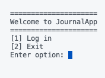
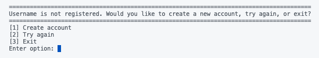
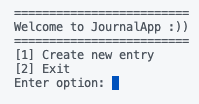
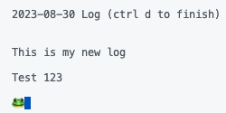
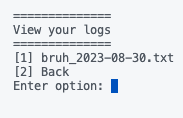
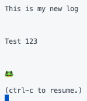

# JournalApp

A simple python journaling app. JournalApp has multiple user capabilty with a user login prompt.

## Information

### General

### [Video demo](https://youtu.be/mcRWRL10bV0?si=E9F9v6Fb19Le6vI_)

When opening JournalApp, you are greeted with the landing page



Use the log in function even if you don't have an account. When you type an unrecognized username in the log in screen you will be prompted to create an account



Select create account and input your desired username and password. Afterwards, the program will restart and you will be able to log in with your new username and password. Once you're logged in, you will see the following menu where you are only able to create, not view, a journal entry since you do not have any previous entries



Create a new entry, and make sure to ctrl-d to force stop the journaling function once you're done



Try not to name your current journal the same thing as a previous one due to the possibility of it being overwritten. This is slightly circumvented by the automatic date suffix on each file. Yet still, better to be safe than sorry.

You are able to view your journal entry and any subsequent ones created from the user menu. Ctrl-c again to exit out of preview mode






### Project.py
Main project file of the app. Handles all of the general functionality and calling functions / methods from other files.

### Prompts.py
Prompts.py is essentially a class holder for the large amount of prompts presented to the user. Prompts are divided into classes:
```python
class General:
    def prompt():
        ...

class Menu:
    def prompt():
        ...
```


### Database.py
Handles accessing and reading information from the database of users.

### Users.csv
Stores all users and passwords. Accessible with:

```python
with open('users.csv') as file:
    content = csv.reader(file)
    return content
```


### Dependencies

* sys
* os
* datetime
* csv
* time
* pytest

#### Can be auto-installed with:

```console
$ pip install requirements.txt
```
## Version History
* 0.1
    * Initial Release

## Written by

### Toma Ozarchevici  - [GitHub](https://github.com/toma-oz)

